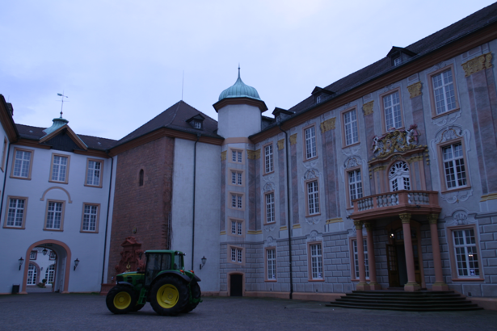
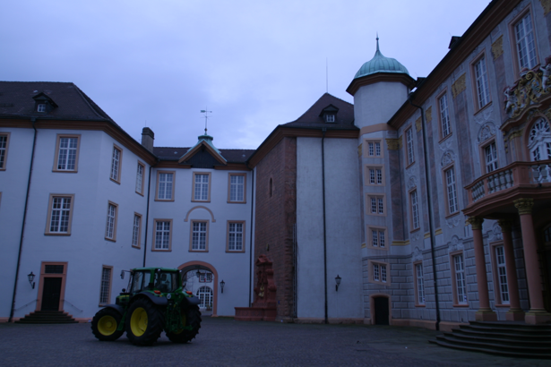

# Structure From Motion
## 3D Reconstruction from Stereo Images

  
  

  
  
  
  
  
  
  

This repository focuses on 3D reconstruction from stereo images using the Lucas-Kanade method for feature detection, matching, and triangulation. The project is implemented in Python using OpenCV and NumPy. The following functionalities are covered:

## Image Loading and Feature Detection:

Two stereo images (0014_2.png and 0017_2.png) are loaded and displayed.
SIFT features are detected in both images, and keypoint descriptors are computed.

## Feature Matching:

Keypoint descriptors from both images are matched using the Brute-Force Matcher.
The number of matches is displayed, and all matches are visualized.

## Calibrated Coordinates:

Calibrated coordinates are computed using the intrinsic calibration matrix K.
Keypoint matches are transformed into calibrated coordinates.

## Epipolar Geometry Estimation:

Two methods are employed to estimate the essential matrix (E): Least Squares Estimation and RANSAC.
RANSAC is used to robustly estimate E, and inliers are visualized.

## Epipolar Lines and Pose Candidates:

Epipolar lines are plotted on both images for inlier matches.
Pose candidates are generated from the estimated essential matrix.

## 3D Reconstruction:

3D reconstruction is performed using pose candidates and calibrated coordinates.
Reconstruction results are visualized in a 3D plot.

## Reprojection Visualization:

The reprojection of 3D points onto both images is visualized.
Blue squares represent keypoints, red circles represent reprojections.
This project combines computer vision techniques, geometric transformations, and optimization to reconstruct a 3D scene from stereo images. The code includes modular components for keypoint detection, feature matching, epipolar geometry, and 3D reconstruction. Users can explore different calibration parameters, essential matrix estimation methods, and pose candidates to analyze their impact on the reconstruction results.
